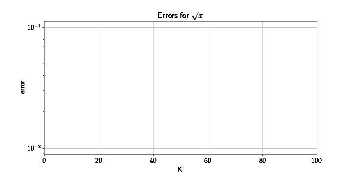

## Implementation of Axon algorithm for function approximation

Code for the paper ["Growing axons: greedy learning of neural networks with application to function approximation"](https://arxiv.org/abs/1910.12686)

### Prerequisites
Prior installation of [nevergrad](https://github.com/facebookresearch/nevergrad) is required:
```
pip install nevergrad
```

### Example
Error function decrease with adding basis function for approximation of $\sqrt{x}$:

